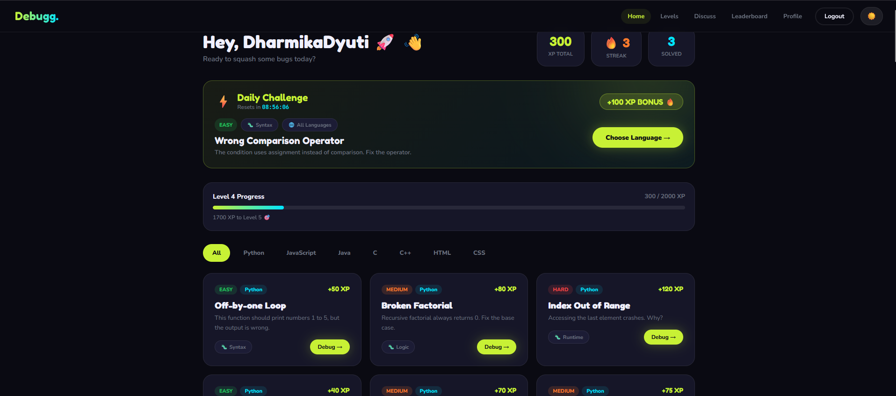
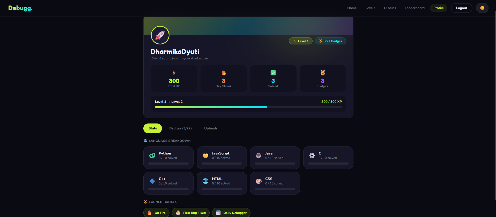
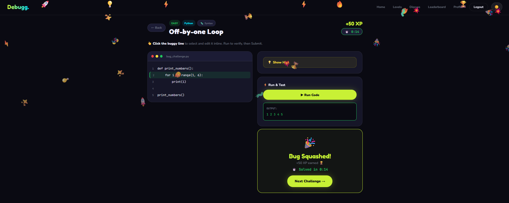
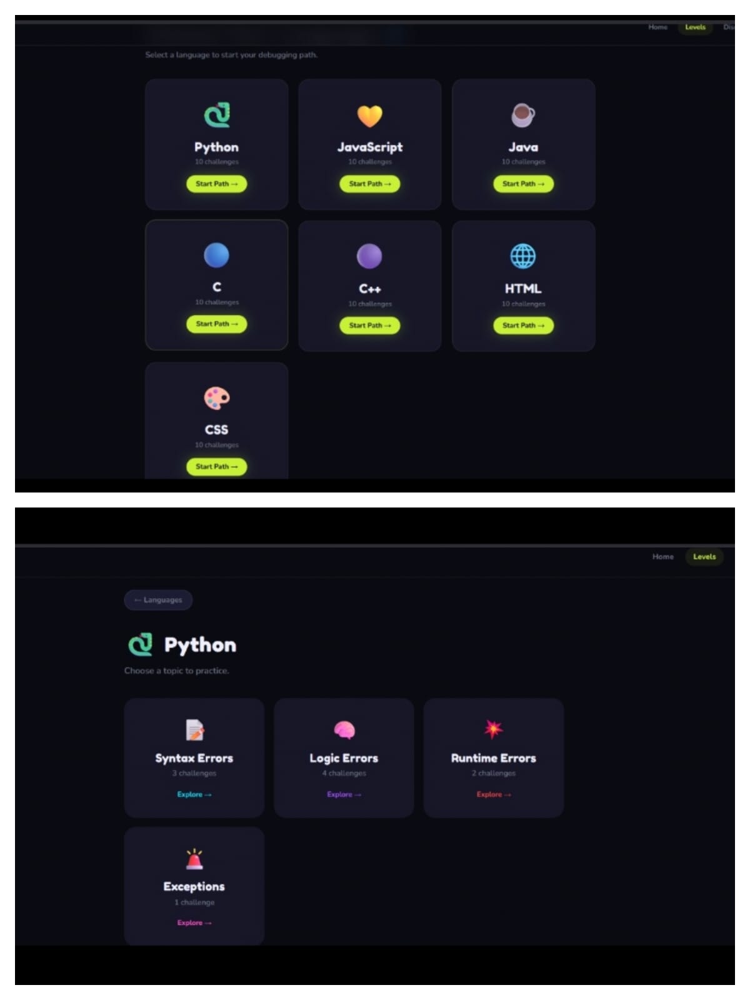
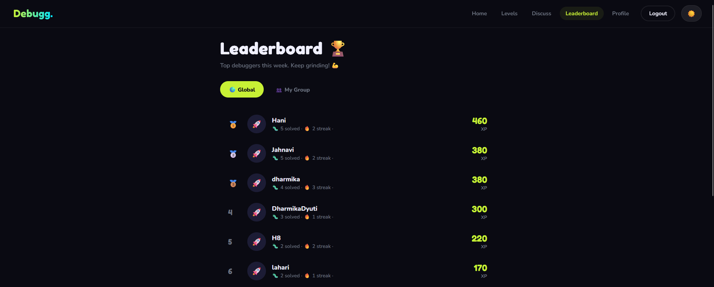
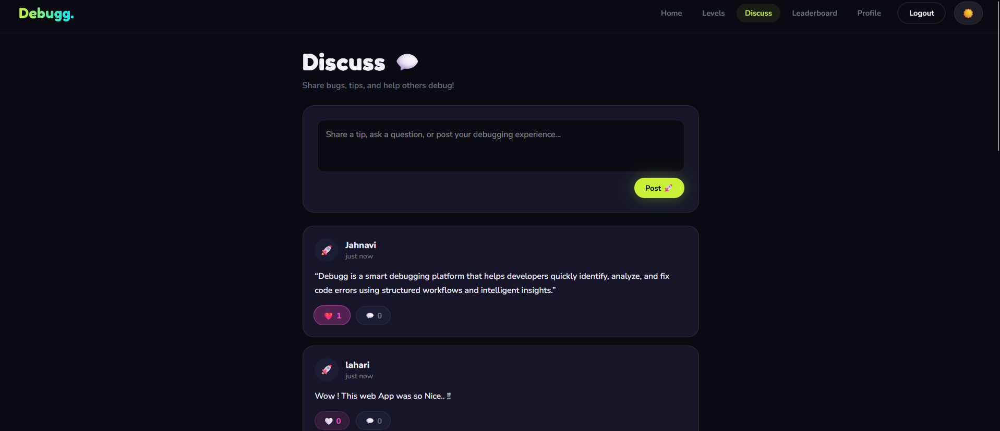

# 🐛 Debugg — Learn to Code by Debugging

**The Duolingo of programming — but for real developers.**

Debugg is a gamified coding-education platform where instead of writing code from scratch, you **fix real, buggy code**. Spot the bug, apply the fix, run it, and earn XP, badges, and leaderboard rank as you level up across languages like JavaScript, Python, Java, and HTML.


---

## ✨ Features

- 🐛 **Debug Real Code** — Fix actual buggy snippets across multiple languages (JavaScript, Python, Java, HTML, and more).
- 🎮 **Levels & XP** — Progress through difficulty tiers, unlock new challenges, and earn XP for every correct fix.
- 🏆 **Leaderboard** — Compete on a global leaderboard, ranked by XP.
- 💬 **Community / Discuss** — Post questions, share tips, comment, and like posts from fellow debuggers.
- 📅 **Daily Challenge** — A fresh timed challenge every day, with a live countdown to the next one.
- 🏅 **Profile & Badges** — Track your stats, earn badges, and submit your own community challenge uploads.
- 🛠️ **Dev Dashboard** — A moderation/publishing queue where approved challenge submissions become live challenges.
- 🌗 **Light / Dark Mode** — Full theme toggle across the entire app.
- 🔐 **Authentication** — Email/password sign-up & login, plus Google sign-in via Firebase Auth.
- ☁️ **Realtime Data** — Challenges, users, posts, and submissions are all backed by Firebase Firestore.

---

## 🖥️ Screenshots

| Landing Page | Dashboard | Challenge (Debug View) |
|---|---|---|
|  |  |  |


| Levels | Leaderboard | Community |
|---|---|---|
|  |  |  |

---

## 🧰 Tech Stack

- **Frontend:** React + TypeScript (functional components + hooks)
- **Styling:** Custom CSS-in-JS / injected stylesheet (Nunito, Fredoka One, JetBrains Mono via Google Fonts)
- **Backend / Database:** Firebase Authentication + Cloud Firestore
- **Auth Providers:** Email/Password, Google (OAuth via `signInWithPopup`)

---

## 📁 Project Structure

```
debugg/
├── public/                 # Static assets
├── src/
│   ├── App.tsx             # Main app and page components
│   ├── firebase.js         # Firebase configuration and initialization
│   ├── styles.css          # Global styles
│   └── ...
├── functions/              # Firebase backend functions
├── docs/
│   └── images/             # README screenshots
├── .env.local              # Environment variables (not committed)
├── firebase.json           # Firebase configuration
├── firestore.rules         # Firestore security rules
├── tsconfig.json           # TypeScript configuration
├── package.json             # Project dependencies and scripts
├── package-lock.json
└── README.md
```

---

## 🚀 Getting Started

### Prerequisites

- [Node.js](https://nodejs.org/) v16+
- npm or yarn
- A [Firebase](https://firebase.google.com/) project (Firestore + Authentication enabled)

### 1. Install dependencies
```bash
npm install
# or
yarn install
```

### 2. Configure Firebase

```js
import { initializeApp } from "firebase/app";
import { getAuth } from "firebase/auth";
import { getFirestore } from "firebase/firestore";
 
const firebaseConfig = {
  apiKey: "YOUR_API_KEY",
  authDomain: "YOUR_PROJECT.firebaseapp.com",
  projectId: "YOUR_PROJECT_ID",
  storageBucket: "YOUR_PROJECT.appspot.com",
  messagingSenderId: "YOUR_SENDER_ID",
  appId: "YOUR_APP_ID",
};
 
const app = initializeApp(firebaseConfig);
export const auth = getAuth(app);
export const db = getFirestore(app);
```

In the Firebase console, enable:
- **Authentication** → Email/Password and Google sign-in providers
- **Firestore Database** → with collections: `users`, `challenges`, `posts`, `submissions`

### 3. Run the app

```bash
npm start
# or
yarn start
```
---

## 🗺️ App Pages

| Page | Description |
|---|---|
| **Landing** | Marketing/hero page with feature highlights and stats |
| **Auth (Login/Signup)** | Email/password and Google authentication |
| **Dashboard** | Overview of available and filtered challenges |
| **Levels** | Language → topic → difficulty selection with unlockable levels |
| **Challenge Page** | Interactive debugging view — select buggy line, apply fix, run, submit |
| **Daily Challenge** | Timed daily challenge with countdown |
| **Leaderboard** | Global XP rankings |
| **Discuss** | Community feed — post, comment, like, groups |
| **Profile** | User stats, badges, and challenge submission form |
| **Dev Dashboard** | Review/approve/reject community submissions and publish new challenges |

---

## 🚀 Future Improvements

- Add support for more programming languages
- Introduce streaks and achievement milestones
- Add more advanced debugging challenges
- Improve challenge recommendation based on user performance
- Add automated challenge validation

---

## 🤝 Contributing

Contributions are welcome! Feel free to open an issue or submit a pull request for new challenges, bug fixes, or feature ideas.

